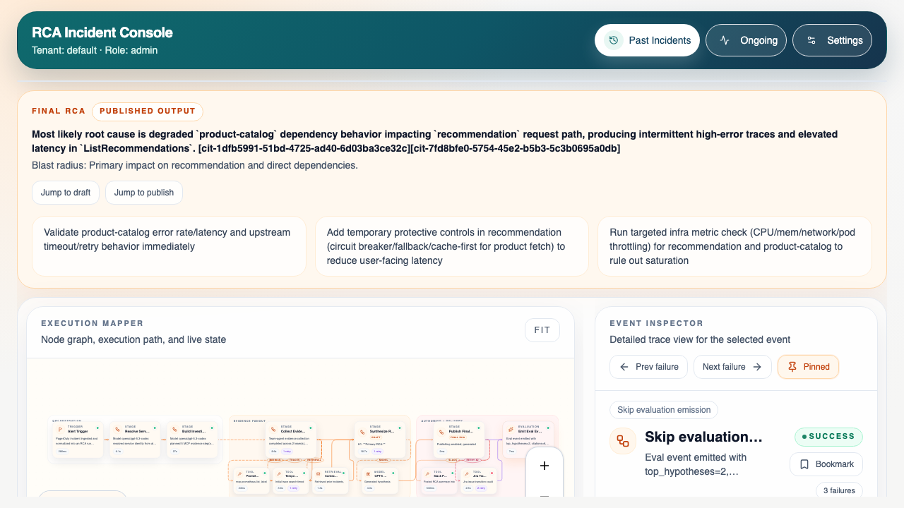
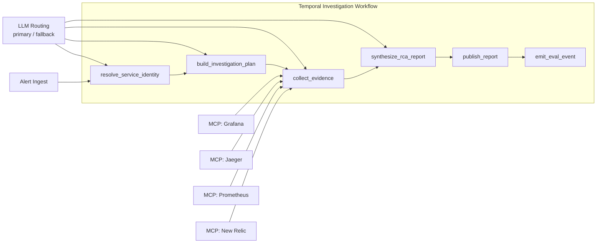

# Agentic RCA Platform

Cloud-agnostic, Kubernetes-first, Apache-2.0 open-source platform for alert-driven root-cause analysis (RCA).

> Reduced incident investigation from hours to minutes for enterprise customers. Presented at OpenAI Codex Dev Meetup, March 2026. Cloud-agnostic, Kubernetes-first, Apache-2.0.



## Key Features

- 6-stage Temporal-orchestrated investigation pipeline for alert-to-RCA execution.
- Multi-provider LLM routing with per-tenant primary/fallback model configuration.
- Eval gating with golden datasets, adjudication, and compare-mode rollout control.
- MCP-native tool discovery and execution across Grafana, Jaeger, Prometheus, and New Relic.
- Python plugin SDK for custom connectors and capability-based routing.
- Full web UI with incident console, workflow inspector, and interactive execution mapper.
- Helm chart + CRDs for Kubernetes-first deployment and runtime configuration.

## Architecture Diagram



## Product Boundaries (v1)

- RCA-only output (top-3 hypotheses + evidence + confidence), no autonomous remediation.
- Read-only investigations across connectors.
- Slack + Jira publishing supported.
- Compare-first rollout for agentic stages (`compare` -> `active`).
- Formal eval gating and human-adjudication support.

## What Is Implemented

- Temporal-orchestrated investigation workflow with six stages:
  1. `resolve_service_identity`
  2. `build_investigation_plan`
  3. `collect_evidence`
  4. `synthesize_rca_report`
  5. `publish_report`
  6. `emit_eval_event`
- Agentic resolver/planner runtime with:
  - model routing (primary/fallback),
  - tool-calling loop with limits,
  - Pydantic output validation,
  - compare-mode diff capture,
  - strict fail behavior in active mode.
- Tool registry across built-in connector tools + MCP-discovered tools.
- Settings APIs for MCP servers, prompt profiles, and rollout mode.
- Web UI console (`services/web-ui`) with:
  - past/ongoing incident views,
  - workflow run timeline/inspector,
  - interactive mapper (drag/pan/zoom/minimap/reset),
  - mapper layout persistence per tenant+user+workflow key,
  - settings pages for connectors, LLM routes, MCP, prompts, rollout.

## Current State And Learnings

- The workflow now resolves telemetry aliases anchor-first and stays scoped to the alerted service more reliably.
- Investigation runs expose stage reasoning, sanitized tool traces, artifact blackboards, rerun directives, and team mission outcomes in the inspector.
- MCP-only execution is in place across resolver, planner, and evidence collection, with Jaeger, Grafana, and Prometheus MCP support for local testing.
- The largest remaining quality gap is not resolver scope anymore; it is evidence execution depth.
  - planner can emit service-correct Jaeger and Prometheus steps,
  - but evidence collection still needs to follow those planned steps more strictly,
  - especially for infra metric validation.
- A fuller write-up is in `/Users/vyshak.r/Documents/Agentic-RCA/docs/agentic-rca-learnings.md`.

Current known gaps:

- Infra RCA still degrades to `unknown_not_available` when Prometheus-backed proof is missing.
- App evidence collection still repeats shallow Jaeger probes in some reruns instead of drilling into trace details.
- Final synthesis still needs stricter abstention/confidence behavior when required evidence classes are missing.
- Some runs still return fewer than the required top-3 hypotheses.

## Tech Stack

- Runtime: Python
- Orchestration: Temporal
- UI: Next.js + TypeScript + React Flow
- Data defaults: PostgreSQL + Redis (platform target), in-memory store for local dev
- Deployment: Kubernetes (Helm + CRDs)
- License: Apache-2.0

## Repository Layout

- `services/ingest-api`
- `services/orchestrator`
- `services/analysis-engine`
- `services/eval-service`
- `services/web-ui`
- `platform_core`
- `connectors/core/newrelic`
- `connectors/core/azure`
- `connectors/core/otel`
- `sdk/plugin-sdk-python`
- `charts/rca-platform`
- `crds/`
- `evals/golden-datasets/`
- `examples/`

## Local Development

### Prerequisites

- Python 3.11+
- Node.js 18+
- Docker (for Temporal local)

### One-Command Local Stack (Docker Compose)

Start all local services (Temporal, ingest API, worker, web UI):

```bash
docker compose -f docker-compose.local.yml up -d --build
```

Or via `make`:

```bash
make compose-up
```

Check container health and status:

```bash
make compose-ps
```

Stop the stack:

```bash
make compose-down
```

Tail logs:

```bash
make compose-logs
```

Restart only the web UI after frontend-only changes:

```bash
make compose-restart-web
```

Service URLs:

- Web UI: `http://localhost:3001`
- Ingest API: `http://localhost:8000`
- Temporal UI: `http://localhost:8088` (or `${TEMPORAL_UI_PORT}`)

Notes:

- `ingest-api` and `web-ui` now publish container health checks, and the worker/UI wait for the API to become healthy before starting.
- The `web-ui` container only runs `npm ci` when `services/web-ui/package-lock.json` changes, which avoids a full dependency install on every restart while keeping local Docker in sync with frontend dependency updates.

### 1) Install dependencies

```bash
python3 -m venv .venv
source .venv/bin/activate
make setup
make web-install
```

### 2) Start Temporal

```bash
docker compose -f infra/temporal/docker-compose.yml up -d
```

### 3) Run services (3 terminals)

Terminal A:

```bash
.venv/bin/python -m uvicorn services.ingest-api.app.main:app --host 0.0.0.0 --port 8000
```

Terminal B:

```bash
.venv/bin/python -m services.orchestrator.app.worker
```

Terminal C:

```bash
cd services/web-ui
npm run dev -- --port 3001
```

### 4) Open local UIs

- Web UI: `http://localhost:3001`
- Temporal UI: `http://localhost:8088` (or `${TEMPORAL_UI_PORT}`)
- Ingest health: `http://localhost:8000/v1/health`

### 5) Seed demo incidents

```bash
TS=$(date -u +"%Y%m%dT%H%M%SZ")
curl -sS -X POST http://localhost:8000/v1/alerts \
  -H 'content-type: application/json' \
  --data "{
    \"source\":\"newrelic\",
    \"severity\":\"critical\",
    \"incident_key\":\"demo-checkout-$TS\",
    \"entity_ids\":[\"service-checkout\"],
    \"timestamps\":{\"triggered_at\":\"$(date -u +%Y-%m-%dT%H:%M:%SZ)\"},
    \"raw_payload_ref\":\"newrelic://demo-checkout-$TS\",
    \"raw_payload\":{\"condition\":\"error_rate_spike\"}
  }"
```

Tip: stop the worker temporarily before posting alerts if you want incidents to remain in `running` state for the Ongoing view demo.

## API Surface (Current)

### Core Investigation APIs

- `POST /v1/alerts`
- `POST /v1/alerts/newrelic`
- `POST /v1/alerts/grafana`
- `GET /v1/investigations`
- `GET /v1/investigations/{id}`
- `GET /v1/investigations/{id}/events` (SSE)
- `POST /v1/investigations/{id}/runs`
- `GET /v1/investigations/{id}/runs`
- `GET /v1/investigations/{id}/runs/{run_id}`
- `GET /v1/investigations/{id}/runs/{run_id}/events` (SSE)
- `POST /v1/investigations/{id}/rerun`
- `POST /v1/internal/runs/events` (internal callback)

### Settings APIs

- `GET /v1/settings/connectors`
- `PUT /v1/settings/connectors/{provider}`
- `POST /v1/settings/connectors/{provider}/test`
- `GET /v1/settings/llm-routes`
- `PUT /v1/settings/llm-routes`
- `GET /v1/settings/mcp-servers`
- `PUT /v1/settings/mcp-servers/{server_id}`
- `POST /v1/settings/mcp-servers/{server_id}/test`
- `GET /v1/settings/mcp-servers/{server_id}/tools`
- `GET /v1/settings/agent-prompts`
- `PUT /v1/settings/agent-prompts/{stage_id}`
- `GET /v1/settings/agent-rollout`
- `PUT /v1/settings/agent-rollout`

### UI Layout APIs

- `GET /v1/ui/workflow-layouts/{workflow_key}`
- `PUT /v1/ui/workflow-layouts/{workflow_key}`

### Ops APIs

- `GET /v1/me`
- `GET /v1/metrics`
- `GET /v1/health`

## Environment Variables

Backend:

- `TEMPORAL_AUTOSTART_ENABLED` (default `true`)
- `TEMPORAL_ADDRESS` (default `localhost:7233`)
- `TEMPORAL_TASK_QUEUE` (default `rca-investigations`)
- `TEMPORAL_UI_PORT` (docker-compose host port for Temporal UI, default `8088`)
- `TEMPORAL_UI_CORS_ORIGINS` (default `http://localhost:8088`)
- `ORCHESTRATOR_EVENT_BASE_URL` (default `http://localhost:8000`)
- `ORCHESTRATOR_EVENT_TOKEN` (optional)
- `API_KEY` (optional; if set, required by API)
- `CORS_ALLOW_ORIGINS` (default `http://localhost:3000`; set to include `http://localhost:3001` for local web UI)
- `RCA_MODEL_ALIAS_CODEX` (required when LLM route uses friendly alias `codex`)
- `RCA_MODEL_ALIAS_CLAUDE` (required when LLM route uses friendly alias `claude`)

Web UI:

- `NEXT_PUBLIC_API_BASE_URL` (default `http://localhost:8000`)
- `INTERNAL_API_BASE_URL` (optional server-side override for containerized web UI)
- `NEXT_PUBLIC_API_KEY` (optional)
- `NEXT_PUBLIC_DEFAULT_TENANT` (default `default`)
- `NEXT_PUBLIC_DEFAULT_ROLE` (default `admin`)
- `NEXT_PUBLIC_DEFAULT_USER` (default `web-ui`)

MCP auth helpers:

- `NEW_RELIC_API_KEY` (recommended for New Relic MCP when `secret_ref_key=NEW_RELIC_API_KEY`)
- `MCP_NEWRELIC_INCLUDE_TAGS` (optional comma-separated include tags forwarded as `include-tags` header)
- `GRAFANA_MCP_API_KEY` (optional for Grafana MCP endpoints that require API key bearer auth)
- `GRAFANA_URL` (used by local `grafana/mcp-grafana` sidecar, defaults to local demo URL)
- `GRAFANA_SERVICE_ACCOUNT_TOKEN` (Grafana token for local `grafana/mcp-grafana` sidecar)
- `GRAFANA_ORG_ID` (optional org id for local `grafana/mcp-grafana`)
- `JAEGER_BASE_URL` (used by local `jaeger-mcp` sidecar, defaults to `http://host.docker.internal:50734`)
- `JAEGER_API_PREFIX` (defaults to `/jaeger/ui/api`)
- `JAEGER_TIMEOUT_SECONDS` (default `10`)

## New Relic MCP Setup (Claude/Codex Tool Access)

1. Add your New Relic user/API key to backend env:
   - `NEW_RELIC_API_KEY=...`
2. In **Settings -> MCP Server Registry**, add:
   - `server_id`: `newrelic`
   - `base_url`: `https://mcp.newrelic.com/mcp/`
   - `secret_ref_key`: `NEW_RELIC_API_KEY`
   - `enabled`: `true`
3. Click **Test** and then **Load Tools** in the MCP section.
4. Keep agent rollout in `compare` until traces/outputs look correct, then switch to `active`.

Notes:

- MCP client now uses streamable HTTP JSON-RPC (`initialize`, `tools/list`, `tools/call`).
- For compatibility, legacy `/tools` and `/invoke` fallback is still supported.
- The client sends both `Authorization: Bearer <token>` and `Api-Key: <token>` when a token is resolved.
- `PUT /v1/settings/llm-routes` validates model aliases; unresolved `codex`/`claude` aliases return HTTP `400`.

## Grafana Alerting + Grafana MCP Setup

1. Configure Grafana webhook contact point to:
   - `POST /v1/alerts/grafana`
   - Example public URL: `https://<your-tunnel-domain>/v1/alerts/grafana?apiKey=<API_KEY>`
2. The Grafana webhook payload is normalized into canonical `AlertEnvelope` (`source=grafana`) and starts the same Temporal workflow.
3. Optional local Grafana MCP sidecar:
   - `docker compose -f docker-compose.local.yml -f docker-compose.grafana-mcp.local.yml up -d grafana-mcp`
   - or `make compose-up-grafana-mcp`
   - Then register MCP server in Settings:
     - `server_id`: `grafana`
     - `base_url`: `http://grafana-mcp:8000/mcp`
     - `secret_ref_key`: leave blank for local sidecar unless you added endpoint auth.

## Jaeger MCP Setup (Trace Access for Agentic Stages)

1. Start local Jaeger MCP sidecar:
   - `docker compose -f docker-compose.local.yml -f docker-compose.jaeger-mcp.local.yml up -d --build jaeger-mcp`
   - or `make compose-up-jaeger-mcp`
2. Register in **Settings -> MCP Server Registry**:
   - `server_id`: `jaeger`
   - `base_url`: `http://jaeger-mcp:8000/mcp`
   - `secret_ref_key`: leave blank (local sidecar has no auth by default)
3. Click **Test** and **Load Tools**.
4. Optional: start both local MCP sidecars together:
   - `make compose-up-all-mcp`
5. Re-register all local MCP servers in ingest settings after backend restart:
   - `make bootstrap-local-mcp`

## Prometheus MCP Setup (Metric Access for Infra Team)

1. Start local Prometheus MCP sidecar:
   - `docker compose -f docker-compose.local.yml -f docker-compose.prometheus-mcp.local.yml up -d --build prometheus-mcp`
   - or `make compose-up-prometheus-mcp`
2. Register in **Settings -> MCP Server Registry**:
   - `server_id`: `prometheus`
   - `base_url`: `http://prometheus-mcp:8000/mcp`
   - `secret_ref_key`: leave blank for local sidecar unless your Prometheus endpoint is protected
3. Click **Test** and **Load Tools**.
4. The infra team now uses:
   - Grafana MCP for dashboards/annotations/alert metadata
   - Prometheus MCP for label discovery and metric queries

## Testing

```bash
PYTHONPATH=. .venv/bin/pytest -q
cd services/web-ui && npm run build
```

## Kubernetes Assets

- Helm chart: `charts/rca-platform`
- CRDs:
  - `ConnectorConfig`
  - `ModelRoute`
  - `InvestigationPolicy`
  - `CatalogSource`
  - `EvalPolicy`

## Documentation

- API summary: `docs/api.md`
- Architecture: `docs/architecture.md`
- OpenAPI: `docs/openapi.yaml`
